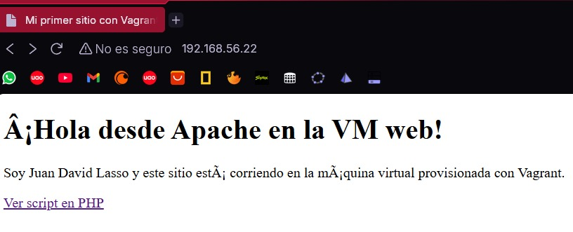
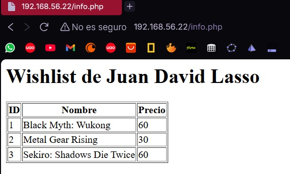
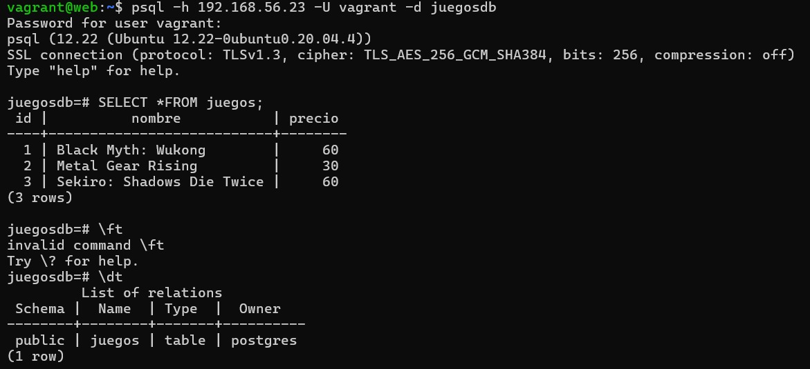

# Taller Vagrant + Provisionamiento con Shell

## Juan David Lasso Chaparro

## Pasos par realizar el reto
--- esto luego de realizar todo lo anterior al reto ---

1. Creé el `provision-db.sh` el cual contiene la instalación y configuración de postgre.

2. Con las maquinas apagadas modifique el Vagrantfile poniendo `web.vm.synced_folder "./www", "/var/www/html"` en la linea 7. Encendí las maquinas virtuales con `vagrant up` desde una terminal de la carpeta con los archivos.

3. Luego me metí a la maquina db con `vagrant ssh db`.

4. Dentro de la maquina ejecuté todos los comandos de `provision-db.sh` y creé la db que en mi caso son de juegos que quiero de steam.

5. Luego ejecuté `sudo -u postgres psql -d juegosdb -c "SELECT * FROM juegos;"` para confirmar que la db se hubiera creado correctamente.

6. Luego me salí de db con `exit` y me metí a web con `vagrant ssh web`.

7. Una  vez dentro verifique que postgresql estuviera instalado en web usando `php -m | grep pgsql` como no me salio nada quiere decir que no esta instalado, lo instale con `sudo apt-get install -y php-pgsql`, por ultimo usé `sudo systemctl restart apache2` refrescando todo para que funcione.

8. Luego me salí con `exit` y me meti a db con `vagrant ssh db` y repeti los comandos del paso 7.

9. Primero verifiqué que el estado de postgresql con `sudo systemctl status postgresql` revise que estuviera activo.

10. Modifiqué postgresql.conf `sudo nano /etc/postgresql/*/main/postgresql.conf` y donde decia `#listen_addresses ='localhost'` lo cambié por `listen_addresses ='*'` esto para que reconociera más direcciones IP.

11. Tambien modifiqué el pg_hba.conf con `sudo nano /etc/postgresql/*/main/pg_hba.conf` y en la ultima linea coloqué `host all all 192.168.56.0/24 md5` esto siguiendo la separación de columnas del archivo, reinicié el postgres para que se reflejaran los cambios con `sudo systemctl restart postgresql` y por ultimo verifique lo realizado de las ip con `sudo ss -tunlp | grep postgres`

12. Me salí de db y me metí a web y con `sudo apt-get install -y postgresql-client` instalé el cliente de postgre. Luego con `psql -h 192.168.56.23 -U vagrant -d juegosdb` entre al shell de la base de datos usando el usuario y contraseña creados en el paso 4, y puse `\dt` para que me mostrara la info de la db y con `SELECT *FROM juegos;` obtuve los datos almacenados en la tabla.

13. Luego me sali del shell de la db con `exit`, me dejo en web, alli puse `sudo apt-get update -y` para actualizar y `sudo apt-get install -y apache2 php libapache2-mod-php php-pgsql` me sirvio para instalar lo que necesitaba de php y su conexion con apache.

14. Usando `sudo systemctl enable apache2` activé el servicio de apache para posteriormente iniciarlo con `sudo systemctl start apache2`. copie los archivos de una carpeta a otra con `sudo cp -r /vagrant/www/* /var/www/html/`.

15. Como paso final verifiqué los comandos anteriores con `php -m | grep pgsql` para ver lo de php y `sudo systemctl status apache2` para ver el servicio de apache.

- para subir los archivos al repositorio priemro inicie sesion en github desde la shell y use `git add .`, luego `git commit -m "Archivo luego de realizar el reto"` y lo subia con `git push origin main` 

# Imagen de la pagina html

# Imagen del info.php

# Imagen de la conexión entre las maquinas virtuales
